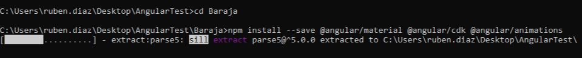

# AngularStarter

## Caracteristicas de angular

* La logica esta escrita en typescript
* La vista en html
* Soporta multiples tipos de hojas de estilo:
  * [CSS](https://developer.mozilla.org/es/docs/Learn/CSS/Introduction_to_CSS/Como_funciona_CSS)
  * [SCSS](http://sass-lang.com/documentation/file.SASS_REFERENCE.html#syntax)
  * [Sass](http://sass-lang.com/documentation/file.INDENTED_SYNTAX.html)
  * [Less](http://lesscss.org)
  * [Stylus](http://stylus-lang.com)
* Soporte para plantillas
* Optimizacion, debido a que solo carga el codigo requerido para la vista actual.
* Funciona en cualquier dispositivo capaz de cargar una web, ya que angular carga html/css y javascript.

## Requisitos

* Tener instalado [Node](https://nodejs.org/)  
* Dos consolas  
* Cualquier editor de texto:  
  * [VS Code](https://code.visualstudio.com/)  
  * [Eclipse](https://www.eclipse.org/)  

## Herramientas y otros recursos

[Angular IO](https://angular.io/)

## Primeros pasos

### Instalar Node

```sh
npm install -g @angular/cli
```

### Crear Nuevo Proyecto

```sh
ng new (Nombre proyecto)
```

### Iniciar servidor

```sh
cd (Nombre proyecto)
ng serve --open
```

Esto iniciará el servidor y una ventana del navegador predeterminado con la app  
Sobre esto vamos a crear una aplicacion de ejemplo, para ello usaremos Angular Material

### Instalar material y dependencias

```sh
npm install --save @angular/material @angular/cdk @angular/animations
npm install --save angular/material2-builds angular/cdk-builds angular/animations-builds
npm install --save hammerjs
```



Una vez que acabe de instalar nos mostrará:


Aqui se pueden verlas advertencias y problemas que hayan surgido durante el proceso de instalacion y otra informacion util

### Administracion de dependencias instaladas

Para poder usar los paquetes instalado, primero tenemos que importar los modulos de estos.

```source/app/app.module.ts```

Este seria el fichero recien creado

```ts
import { BrowserModule } from '@angular/platform-browser';
import { NgModule } from '@angular/core';

import { AppRoutingModule } from './app-routing.module';
import { AppComponent } from './app.component';

@NgModule({
  declarations: [
    AppComponent
  ],
  imports: [
    BrowserModule,
    AppRoutingModule
  ],
  providers: [],
  bootstrap: [AppComponent]
})
export class AppModule { }
```