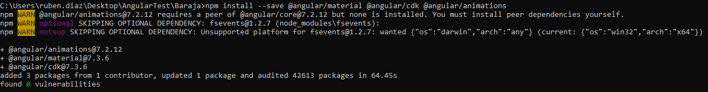

# AngularStarter
## Inicio

* Angular
 
## Caracteristicas de angular

* La logica esta escrita en typescript
* La vista en html
* Soporta multiples tipos de hojas de estilo:
  * [CSS](https://developer.mozilla.org/es/docs/Learn/CSS/Introduction_to_CSS/Como_funciona_CSS)
  * [SCSS](http://sass-lang.com/documentation/file.SASS_REFERENCE.html#syntax)
  * [Sass](http://sass-lang.com/documentation/file.INDENTED_SYNTAX.html)
  * [Less](http://lesscss.org)
  * [Stylus](http://stylus-lang.com)
* Soporte para plantillas
* Optimizacion, debido a que solo carga el codigo requerido para la vista actual.
* Funciona en cualquier dispositivo capaz de cargar una web, ya que angular carga html/css y javascript.

## Requisitos

* Tener instalado [Node](https://nodejs.org/)  
* Dos consolas  
* Cualquier editor de texto:  
  * [VS Code](https://code.visualstudio.com/)  
  * [Eclipse](https://www.eclipse.org/)  

## Herramientas y otros recursos

[Angular IO](https://angular.io/)

## Primeros pasos

### Instalar Angular CLI

```sh
npm install -g @angular/cli
```

### Crear Nuevo Proyecto

```sh
ng new (Nombre proyecto)
```

### Iniciar servidor

```sh
cd (Nombre proyecto)
ng serve --open
```

Esto iniciará el servidor y una ventana del navegador predeterminado con la app  
Sobre esto vamos a crear una aplicacion de ejemplo, para ello usaremos Angular Material

### Instalar material y dependencias

Para este proyecto, vamos a necesitar las siguientes depenencias:
* **`@angular/material:`** Librería principal de Angular Material
* **`@angular/cdk:`** Angular Material Component Development Kit implementa las funcionalidades principales que se utilizan en Angular Material
* **`@angular/animations:`** Brinda soporte para animaciones con web-animations
* **`hammerjs:`** Librería que nos permite reconocer gestos hechos con el raton, pointerEvents, etc.

```sh
npm install --save @angular/material @angular/cdk @angular/animations
npm install --save hammerjs
```


Una vez que acabe de instalar nos mostrará:



Aqui se pueden verlas advertencias y problemas que hayan surgido durante el proceso de instalacion y otra informacion util

### Conceptos teóricos

* **Módulos:**
	Son contenedores de componentes, proveedores de servicios, etc.
	Todas las aplicaciones hechas con Angular tienen al menos una clase con la anotación "@NgModule" llamada "root module"
	Dentro de la anotación '@NgModule' se definen los siguientes componentes:
	* **providers:**
		Objetos inyectables (servicios) que se encuentran disponibles en el inyector de este modulo
	* **declarations:**
		Conjunto de Componentes, Directivas, Tuberías, etc declaradas en nuestro modulo.
		A medida que vayamos creando nuevos Componentes estos deberan ser añadidos en esta propiedad
	* **imports:**
		Conjunto de NgModules(Otros) cuyos declarables (exportados explícitamente) se desean usar en este modulo
	* **exports:**
		Conjunto de declarations que se desean exportar, para que otros módulos los puedan usar al importarnos
	* **bootstrap:**
		Conjunto de componentes que se insertan dentro del index.html cuando la aplicación se inicia. Generalmente va el "root component"

* **Tuberías:**
	Similares a las pipes en UNIX, se utilizan para transformar información de un formato a otro dentro de las plantillas
	
* **Proveedores:**
	Los proveedores dan instrucciones al Sistema de Inyección de Dependencias sobre como obtener un valor para una dependencia

* **Componentes:**
	Son las Clases anotadas con el decorador "@Component()".
	Cada Componente controla una región de la ventana del navegador.
	Están asociados con una plantilla, los dos juntos forman una Vista.
	
	* **Plantilla:**
	Código que define como mostrar la vista del componentes
	Está formado de Código HTML + directivas, tuberías, etc.

* **Directivas:**
	Son las Clases anotadas con el decorador "@Directive()".
	Las Directivas pueden modificar la estructura del DOM o modificar los atributos en el DOM.

* **Servicios:**
	Son las clases anotadas con el decorador "@Injectable()".
	Clases con un propósito concreto y guardan lógica no relacionada con la Interfaz de Usuario.
	Contienen métodos y atributos que se utilizan para el intercambio de información entre Componentes,
	validar input del usuario, bajar datos del servidor.
	
* **Inyección de Dependencias (DI):**
	Primero de todo, las Dependencias son servicios u objetos que una clase necesita para realizar su función.
	Ahora bien, la Inyección de Dependencias consiste en que las Clases piden estas dependencias de otros NgModules en vez de crear los servicios u objetos manualmente.
	
* **Data Binding:**
	Proceso que permite a la aplicación mostrar valores al usuario y responder a acciones del usuario.
	Los dos Data Bindings principales son:
	* **Event binding:**
		Nos permite escuchar (suscribirnos) a ciertos tipos de eventos, como pulsaciones del teclado, clicks, etc.
	* **Property binding:**
		Nos permite asociar valores calculados o almacenados dentro el controlador a los elementos dentro del HTML (dentro de las plantillas)

* **Inyector:**
	Son objetos utilizados por el sistema de inyección de dependencias para encontrar dependencias
    
* **Diagrama:**

	

* **Enlaces útiles:**

    [Glosario](https://angular.io/guide/glossary)

### Administracion de dependencias instaladas

#### main.ts

```sh
src/main.ts
```

Aqui van las librerias que se cargan de lado de cliente, como por ejemplo boostrap o hammer.js

```ts
import { enableProdMode } from '@angular/core';
import { platformBrowserDynamic } from '@angular/platform-browser-dynamic';

import 'hammerjs';
import { AppModule } from './app/app.module';
import { environment } from './environments/environment';

if (environment.production) {
  enableProdMode();
}

platformBrowserDynamic().bootstrapModule(AppModule)
  .catch(err => console.error(err));

```

#### app.module.ts

Librerias de servidor

Para poder usar los paquetes instalados primero tenemos que importar sus modulos.
La importacion de modulos se realiza desde el archivo:

```sh
src/app/app.module.ts
```

Así es como se ve el fichero recien creado

```ts
import { BrowserModule } from '@angular/platform-browser';
import { NgModule } from '@angular/core';

import { AppRoutingModule } from './app-routing.module';
import { AppComponent } from './app.component';

@NgModule({
  declarations: [
    AppComponent
  ],
  imports: [
    BrowserModule,
    AppRoutingModule
  ],
  providers: [],
  bootstrap: [AppComponent]
})
export class AppModule { }
```

Sobre el vamos a importar las siguientes depencias:

* HttpClientModule
* MatInputModule
* MatTableModule
* MatPaginatorModule
* MatSortModule
* MatProgressSpinnerModule
* MatDialogModule
* BrowserAnimationsModule

Importante, HttpClientModule siempre se debe importar despues de haber importado BrowserModule

Así quedaría el archivo final

```ts
import { BrowserModule } from '@angular/platform-browser';
import { NgModule } from '@angular/core';

import { AppRoutingModule } from './app-routing.module';
import { AppComponent } from './app.component';

import { HttpClientModule } from '@angular/common/http';
import { MatInputModule, MatPaginatorModule, MatProgressSpinnerModule,
  MatSortModule, MatTableModule, MatDialogModule } from '@angular/material';
import {BrowserAnimationsModule} from '@angular/platform-browser/animations';

@NgModule({
  declarations: [
    AppComponent
  ],
  imports: [
    BrowserModule,
    HttpClientModule,
    MatInputModule,
    MatTableModule,
    MatPaginatorModule,
    MatSortModule,
    MatProgressSpinnerModule,
    MatDialogModule,
    BrowserAnimationsModule,
    AppRoutingModule
  ],
  providers: [],
  bootstrap: [AppComponent]
})
export class AppModule { }
```

#### Otros imports

Por ejemplo para importar un tema pondremos la siguiente linea en el archivo

```sh
src/style.scss
```

```css
@import "~@angular/material/prebuilt-themes/indigo-pink.css";
```

### Componentes

Para la creacion de un nuevo componente usaremos el siguiente comando

```sh
ng generate component (nombre del componente)
```

En nuestro caso vamos a generar dos, uno para la aplicacion y otro para error

```sh
ng generate component baraja
ng generate component error
```

## Librerias

* Librerias o frameworks  
De un modo o de otro nuestros proyectos han de ser escalables, orientándolo a módulos, utilizando servicios internos en cada módulo y manejando el estado de la aplicación aislado de los componentes.

### Router

Para poder navegar entre vistas de una manera sencilla necesitamos implementar un router

```sh
src/app/app-routing.module.ts
```

Un ejemplo de router puede ser el siguiente:

```ts
import { NgModule } from '@angular/core';
import { Routes, RouterModule } from '@angular/router';
import { BarajaComponent } from './baraja/baraja.component';
import { ErrorComponent } from './error/error.component';

// Definicion de rutas de la aplicacion
const routes: Routes = [
  // Mapeo de componentes
  { path: 'baraja', component: BarajaComponent },
  // Ruta por defecto
  { path: '', redirectTo: '/baraja', pathMatch: 'full' },
  // ** mapea cualquier ruta no definida previamente
  { path: '**', component: ErrorComponent }
];

@NgModule({
  imports: [RouterModule.forRoot(routes)],
  exports: [RouterModule]
})
export class AppRoutingModule { }
```

En el se ve como mapeas cada ruta a un componente  
Cual va a ser la ruta por defecto  
Redirecciones y la pagina de error  

El contenido de el componente se mostrara entre las etiquetas ```<router-outlet></router-outlet>``` del archivo

```sh
src/app/app.component.html
```

```html
<div style="text-align:center">
  <h1>
    Bienvenido a {{ title }}!
  </h1>
  <nav>
    <a routerLink="/baraja" routerLinkActive="active">Baraja</a>
    <a routerLink="/ejemploRutaNoDefinida" routerLinkActive="active">Ruta No Definida</a>
  </nav>
<router-outlet></router-outlet>
```

## Baraja

Trabajaremos con las siguiente clases

```ts
export class Baraja {
  id: number;
  nombre: string;
  cantidadCartas: string;
  marca: string;
}
```

### Http request

```ts
import { Component, OnInit, ViewChild } from '@angular/core';
import { Baraja } from './baraja';
import { HttpClient } from '@angular/common/http';

@Component({
  selector: 'app-baraja',
  templateUrl: './baraja.component.html',
  styleUrls: ['./baraja.component.scss']
})

export class BarajaComponent implements OnInit {
  
  // Constructor para iniciar un cliente http
  constructor(private http: HttpClient) {}

  // Aqui almacenaremos los datos que nos devuelva la request
  dataSource = [];

  // Direccion del servidor
  servidor = 'http://192.168.1.175:8080';

  ngOnInit(): void {
    // Endpoint al que se va a realizar la request
    const endpoint = '/getBarajas';
    // Http request en ella procesamos tanto los datos recibidos, como un posible error en la peticion
    this.http.get<Baraja[]>(this.servidor + endpoint).subscribe(data => {
        this.dataSource.data = data;
        console.log(data);
    }, error => {
      console.log(error);
    });
  }
}
```

Aparte de peticiones get, de esta manera podemos realizar peticiones del tipo:

* Delete
* Get
* Head
* Jsonp
* Option
* Patch
* Post
* Put
* Request

### ANGULAR MATERIAL
- Librería de componentes de Material Design
- Componentes:
    - Control de formularios
    - Navegadores
    - Layouts
    - Botones e indicadores
    - Ventanas emergentes o popups
    - tablas de datos

- Schematics de Material:
    - Barras de herramientas
    - Tablas
    - Formularios
    - Listas de Cuadrículas dinámicas
    - Estructuras de carpetas anidadas
    - Directivas de Drag & Drop
- Incluyen temas y tipografías
- Forma de customizar estilos
- Clases elevation y mixin
- Creación de Steppers personalizados


### BOOTSTRAP
- Biblioteca más utilizada de la parte front-end
- Código abierto para desarrollar con HTML, CSS, Javascript y es multiplataforma
- Es el segundo proyecto más destacado en GitHub y es usado por la NASA, la MSNBC...
- Instalación :
    - npm install bootstrap
    - poner un link en index.html 
- Uso :
    - Se pone en los templates
    - Ej :

```html
<button class="btn btn-warming">
```